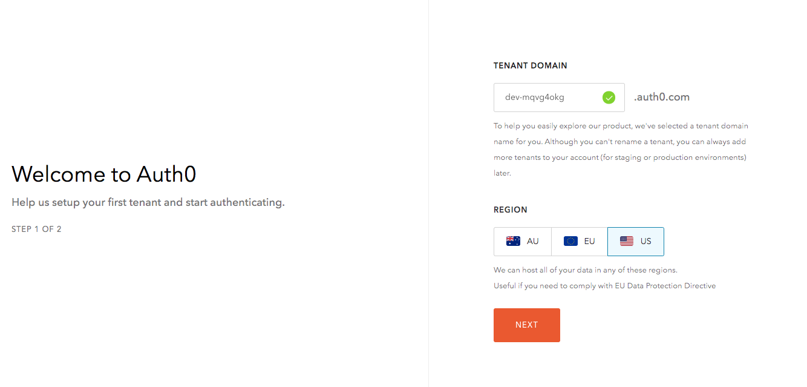
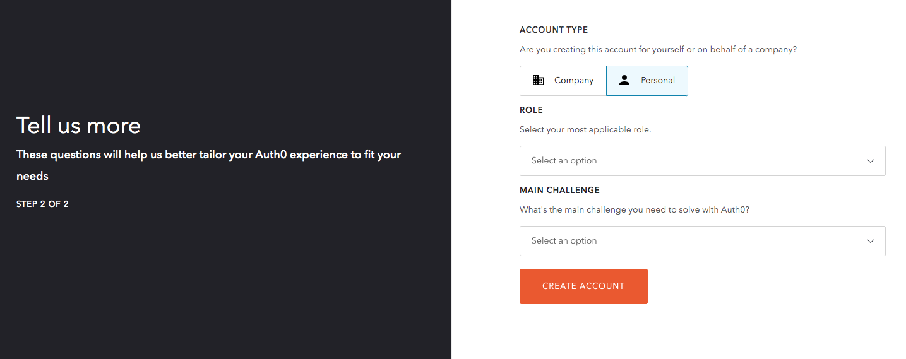
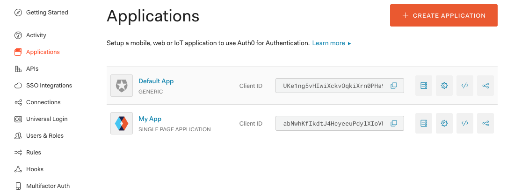

import { CodeSurferLayout, CodeSurferColumnLayout } from 'code-surfer'
import { nightOwlFull } from 'code-surfer'
import { Head } from 'mdx-deck'
import './index.css'
import { Emoji } from './Emoji.js'
import Img from 'components/Img'

export const themes = [
  nightOwlFull,
  {
    colors: {
      text: '#000',
      background: '#fff',
      primary: '#0af',
      black: '#000'
    },
    fontWeights: {
      heading: 600,
      bold: 600
    },
    text: {
      heading: {
        textTransform: 'uppercase',
        letterSpacing: '0.1em'
      }
    },
    styles: {
      pre: {
        color: 'primary',
        bg: 'black'
      },
      code: {
        color: 'primary'
      }
    }
  }
]

export { nightOwlFull as theme } from 'code-surfer'

<Head>

  <link
    href="https://fonts.googleapis.com/css?family=Montserrat:300,300i,400,400i,500,500i,700"
    rel="stylesheet"
  />
</Head>

##### *React* to Authentication with an Auth0 Custom Hook

> -Tyler Clark

---

### :wave: Nice to meet ya

> Twitter: _@iamtylerwclark_

---

##### I need to add Authentication to my app... where do I even start?

---

#### Table of Contents

- Why Auth0?
- Registering your application
- Authentication and Access Tokens
- Reviewing the SDk
- Breaking down the useAuth0 hook

---

### Why Auth0?

> "Identity made simple for Developers"

---

### Sign up step 1



---

### Sign up step 2



---

### Register an application




---

### Quick Start a React app


---

### Download Sample


---

### Sample Code


---

Auth0 SDK


###### Source: https://auth0.com/docs/microsites/call-api/call-api-single-page-app

---


---

### Access tokens

- opaque
- JSON Web Token (JWT)

---

### JSON Web Token (JWT)

- Compact: sent through URL, param, or header
- Self-contained: encrypted or signed
- LocalStorage, cookie, etc... within browser

---


---

<CodeSurferLayout>

```js title="SDK"

npm install @auth0/auth0-spa-js

yarn add @auth0/auth0-spa-js

```
</CodeSurferLayout>

---

<CodeSurferLayout>

```js title="SDK"

<script src="https://cdn.auth0.com/js/auth0-spa-js/1.2/auth0-spa-js.production.js"></script>

```
</CodeSurferLayout>

---

<CodeSurferLayout>

```js title="SDK"

import createAuth0Client from '@auth0/auth0-spa-js';

// either with async/await or promises
const auth0 = await createAuth0Client({
  domain: 'YOUR_DOMAIN',
  client_id: 'YOUR_CLIENT_ID'
});

```

```js title="Login and get user info"
const auth0 = await createAuth0Client({
  domain: 'YOUR_DOMAIN',
  client_id: 'YOUR_CLIENT_ID'
})

document.getElementById('login').addEventListener('click', async () => {
  await auth0.loginWithRedirect({
    redirect_uri: 'http://localhost:3000/'
  });
  const user = await auth0.getUser();
});

```

```js title="Call an API with token"
document.getElementById('callApi').addEventListener('click', async () => {
  const accessToken = await auth0.getTokenSilently();
  const result = await fetch('https://exampleco.com/api', {
    method: 'GET',
    headers: {
      Authorization: 'Bearer ' + accessToken
    }
  });
  const data = await result.json();
  console.log(data);
});

```
</CodeSurferLayout>

---

<CodeSurferLayout>

```js title="Calling your API"

import createAuth0Client from '@auth0/auth0-spa-js';

// either with async/await or promises
const auth0 = await createAuth0Client({
  domain: 'YOUR_DOMAIN',
  client_id: 'YOUR_CLIENT_ID'
});

```

```js title="Login and get user info"
const auth0 = await createAuth0Client({
  domain: 'YOUR_DOMAIN',
  client_id: 'YOUR_CLIENT_ID'
})

document.getElementById('login').addEventListener('click', async () => {
  await auth0.loginWithRedirect({
    redirect_uri: 'http://localhost:3000/'
  });
  const user = await auth0.getUser();
});

```
</CodeSurferLayout>

---

### What comes with the SDK?

- isAuthenticated()
- getUser()
- loginWithPopup()
- handleRedirectCallback()

---

### What comes with the SDK?

- getIdTokenClaims()
- loginWithRedirect()
- getTokenSilently()
- getTokenWithPopup()
- logout()

---

#### React _Context_ & the _useAuth0_ hook

---

<CodeSurferLayout>

```js title="Context"

const Auth0Context = React.createContext()

const useAuth0 = () => useContext(Auth0Context);

```

```js title="Context"

const Auth0Context = React.createContext()

<Auth0Context.Provider
      value={{
        ...
      }}
    >
      {children}
    </Auth0Context.Provider>

```

```js title="Context"

ReactDOM.render(
  <Auth0Provider>
    <App />
  </Auth0Provider>
)

```

```js title="Context"

import { useAuth0 } from "../react-auth0-spa"

const { ... } = useAuth0()

```

</CodeSurferLayout>

---

<CodeSurferLayout>

```js
<Auth0Context.Provider
      value={{
        ...
      }}
    >
      {children}
</Auth0Context.Provider>
```

```js
export const Auth0Provider = ({children}) => {
  return (
    <Auth0Context.Provider
          value={{
            ...
          }}
        >
          {children}
    </Auth0Context.Provider>
    )
}
```

```js
export const Auth0Provider = ({children}) => {
  useEffect(() => {
    const auth0 = await createAuth0Client({
    domain: 'YOUR_DOMAIN',
    client_id: 'YOUR_CLIENT_ID'
    })
  }, [])
  return (
    <Auth0Context.Provider
          value={{
            ...
          }}
        >
          {children}
    </Auth0Context.Provider>
    )
}
```

```js
export const Auth0Provider = ({children}) => {
  const [loading, setLoading] = useState(false)
  ...
  useEffect(() => {
    setLoading(true)
    const auth0 = await createAuth0Client({
    domain: 'YOUR_DOMAIN',
    client_id: 'YOUR_CLIENT_ID'
    })
    setLoading(false)
  }, [])
  return (
    <Auth0Context.Provider
          value={{
            ...
          }}
        >
          {children}
    </Auth0Context.Provider>
    )
}
```

```js
export const Auth0Provider = ({children}) => {
  const [loading, setLoading] = useState(false)
  const [user, setUser] = useState();
  useEffect(() => {
    setLoading(true)
    const auth0 = await createAuth0Client({
    domain: 'YOUR_DOMAIN',
    client_id: 'YOUR_CLIENT_ID'
    })
    setLoading(false)
    const isAuthenticated = await auth0FromHook.isAuthenticated();
    if (isAuthenticated) {
        const user = await auth0FromHook.getUser();
        setUser(user);
      }
  }, [])
  return (
    <Auth0Context.Provider
          value={{
            ...
          }}
        >
          {children}
    </Auth0Context.Provider>
    )
}
```

```js
export const Auth0Provider = ({children}) => {
  const [loading, setLoading] = useState(false)
  const [user, setUser] = useState();
  useEffect(() => {
    setLoading(true)
    const auth0 = await createAuth0Client({
    domain: 'YOUR_DOMAIN',
    client_id: 'YOUR_CLIENT_ID'
    }, [])
    setLoading(false)
    const isAuthenticated = await auth0FromHook.isAuthenticated();
    if (isAuthenticated) {
        const user = await auth0FromHook.getUser();
        setUser(user);
      }
  })
  return (
    <Auth0Context.Provider
      value={{
        isAuthenticated,
        user,
        loginWithPopup,
        handleRedirectCallback,
        getIdTokenClaims: (...p) => auth0Client.getIdTokenClaims(...p),
        loginWithRedirect: (...p) => auth0Client.loginWithRedirect(...p),
        getTokenSilently: (...p) => auth0Client.getTokenSilently(...p),
        getTokenWithPopup: (...p) => auth0Client.getTokenWithPopup(...p),
        logout: (...p) => auth0Client.logout(...p)
      }}
        >
          {children}
    </Auth0Context.Provider>
    )
}
```

```js title="PrivateRoute.js"

import { useAuth0 } from "../react-auth0-spa"

const { isAuthenticated, loginWithRedirect } = useAuth0()

```

```js
export const Auth0Provider = ({children}) => {
  const [loading, setLoading] = useState(false)
  const [user, setUser] = useState();
  useEffect(() => {
    setLoading(true)
    const auth0 = await createAuth0Client({
    domain: 'YOUR_DOMAIN',
    client_id: 'YOUR_CLIENT_ID'
    }, [])
    setLoading(false)
    const isAuthenticated = await auth0FromHook.isAuthenticated();
    if (isAuthenticated) {
        const user = await auth0FromHook.getUser();
        setUser(user);
      }
  })
  return (
    <Auth0Context.Provider
      value={{
        isAuthenticated,
        user,
        loginWithPopup,
        handleRedirectCallback,
        getIdTokenClaims: (...p) => auth0Client.getIdTokenClaims(...p),
        loginWithRedirect: (...p) => auth0Client.loginWithRedirect(...p),
        getTokenSilently: (...p) => auth0Client.getTokenSilently(...p),
        getTokenWithPopup: (...p) => auth0Client.getTokenWithPopup(...p),
        logout: (...p) => auth0Client.logout(...p)
      }}
        >
          {children}
    </Auth0Context.Provider>
    )
}
```

</CodeSurferLayout>

---

# Other references

- [Authenticating Your First React App](https://auth0.com/blog/authenticating-your-first-react-app/)
- [Auth0 React Github samples](https://github.com/auth0-samples/auth0-react-samples)
- [Securing Gatsby with Auth0](https://auth0.com/blog/securing-gatsby-with-auth0/)

---

### Thanks!

