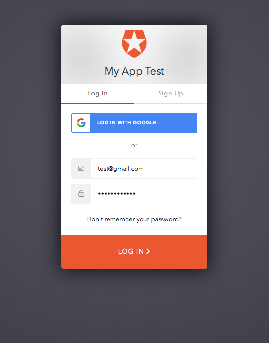

import { CodeSurferLayout, CodeSurferColumnLayout } from 'code-surfer'
import { nightOwlFull } from 'code-surfer'
import { Head } from 'mdx-deck'
import './index.css'
import { Emoji } from './Emoji.js'
import Img from 'components/Img'

export const themes = [
  nightOwlFull,
  {
    colors: {
      text: '#000',
      background: '#fff',
      primary: '#0af',
      black: '#000'
    },
    fontWeights: {
      heading: 600,
      bold: 600
    },
    text: {
      heading: {
        textTransform: 'uppercase',
        letterSpacing: '0.1em'
      }
    },
    styles: {
      pre: {
        color: 'primary',
        bg: 'black'
      },
      code: {
        color: 'primary'
      }
    }
  }
]

export { nightOwlFull as theme } from 'code-surfer'

<Head>

  <link
    href="https://fonts.googleapis.com/css?family=Montserrat:300,300i,400,400i,500,500i,700"
    rel="stylesheet"
  />
</Head>

##### *React* to Authentication with Custom Hooks

---

### :wave: Nice to meet ya

> Twitter: _@iamtylerwclark_

---

##### I need to add Authentication to my app... where do I even start? 😭

---

#### *Authentication* vs. *Authorization*

---

#### *Authentication*

> Authentication is the process of determining if someone is who they say they are.


---

#### *Authentication*

> Checks a user's credentials for a match in a database of authorized users or in a data authentication server.


---

#### Authentication

<div className="containterFlex">
<div className="flex">
  
React App
</div>

<div>
    
    Identity provider
</div>

<div>
  
  Database
</div>
</div>

---

#### What about threats?

# 😈

---

#### SQL Injection

# 💻

---

#### Man-in-the-Middle (MitM)

# 👨‍💻

---

#### Replay attacks

# 💬

---


###### Source: https://auth0.com/docs/microsites/call-api/call-api-single-page-app

---


---

#### So I'm signed in, now what?

# 🤷‍

---

### *Authorization*


---

Access token -> SPA -> API


---


### Authorization with JWTs

JSON Web Token (JWT)


---

Digitally signed with secret HMAC algorithm


---

Encoded -> Decoded -> Access Granted


---

##### React  ❤️ Authorization

---

<div
  dangerouslySetInnerHTML={{
    __html: `
      <video
        style="max-width: 100%"
        controls
        autoplay
        muted
        src="./auth0-walk-through.mp4"
      />
    `,
  }}
/>

---

<CodeSurferLayout>

```js title="Setup"

import createAuth0Client from '@auth0/auth0-spa-js';

const auth0Client = await createAuth0Client({
  domain: 'YOUR_DOMAIN',
  client_id: 'YOUR_CLIENT_ID'
});

```

```js title="Who are you?"

import createAuth0Client from '@auth0/auth0-spa-js';

const auth0Client = await createAuth0Client({
  domain: 'YOUR_DOMAIN',
  client_id: 'YOUR_CLIENT_ID'
});

 const isAuthenticated = await auth0Client.isAuthenticated()

```

```js title="Oh hi tyler"

import createAuth0Client from '@auth0/auth0-spa-js';

const auth0Client = await createAuth0Client({
  domain: 'YOUR_DOMAIN',
  client_id: 'YOUR_CLIENT_ID'
});

 const isAuthenticated = await auth0Client.isAuthenticated()

 const user = isAuthenticated ? await auth0Client.getUser() : null

```

</CodeSurferLayout>

---

#### *SDKs*


---

<CodeSurferLayout>

```js title="Login"
                <button
                  onClick={loginWithRedirect}>
                  Login
                </button>
```

</CodeSurferLayout>

---

<CodeSurferLayout>

```js title="Login"

import createAuth0Client from '@auth0/auth0-spa-js';

const auth0Client = await createAuth0Client({
  domain: 'YOUR_DOMAIN',
  client_id: 'YOUR_CLIENT_ID'
});

```

```js title="Setup"

import createAuth0Client from '@auth0/auth0-spa-js';

const auth0Client = await createAuth0Client({
  domain: 'YOUR_DOMAIN',
  client_id: 'YOUR_CLIENT_ID'
});


const loginWithRedirect = auth0Client.loginWithRedirect(...e)

```

```js title="Setup"

import createAuth0Client from '@auth0/auth0-spa-js';

const auth0Client = await createAuth0Client({
  domain: 'YOUR_DOMAIN',
  client_id: 'YOUR_CLIENT_ID'
});


const loginWithRedirect = auth0Client.loginWithRedirect(...e)

                <button
                  onClick={loginWithRedirect}>
                  Login
                </button>

```

</CodeSurferLayout>

---



---

<CodeSurferLayout>

```js title="Get access tokens"

const auth0Client = await createAuth0Client({
  domain: 'YOUR_DOMAIN',
  client_id: 'YOUR_CLIENT_ID'
});

```

```js title="Get access tokens"

const auth0Client = await createAuth0Client({
  domain: 'YOUR_DOMAIN',
  client_id: 'YOUR_CLIENT_ID'
});


const getTokenSilently = auth0Client.getTokenSilently(...e)

```

```js title="Get access tokens"

const auth0Client = await createAuth0Client({
  domain: 'YOUR_DOMAIN',
  client_id: 'YOUR_CLIENT_ID'
});


const getTokenSilently = auth0Client.getTokenSilently()

fetch('https://some-api.com/test', {
  headers: {
    authorization: getTokenSilently
  }
})

```

</CodeSurferLayout>

---

<CodeSurferLayout>

```js title="Logout"

const auth0Client = await createAuth0Client({
  domain: 'YOUR_DOMAIN',
  client_id: 'YOUR_CLIENT_ID'
});

```

```js title="Logout"

const auth0Client = await createAuth0Client({
  domain: 'YOUR_DOMAIN',
  client_id: 'YOUR_CLIENT_ID'
});


const logout = auth0Client.logout(...e)

```

```js title="Logout"

const auth0Client = await createAuth0Client({
  domain: 'YOUR_DOMAIN',
  client_id: 'YOUR_CLIENT_ID'
});


const logout = auth0Client.logout(...e)

<button
  onClick={() => logout({ returnTo: window.location.origin })}>
  Logout
</button>

```

</CodeSurferLayout>

---

#### *Hooks!* 🎣

---


<CodeSurferLayout>

```js title="Context"

const AuthorizationContext = React.createContext()

```

```js title="Context"

const AuthorizationContext = React.createContext()

export const Authorization = ({children}) => {
  return (
    <AuthorizationContext.Provider
        value={{
          ...
        }}
      >
        {children}
      </AuthorizationContext.Provider>
    )
}

```

</CodeSurferLayout>

---


<CodeSurferLayout>

```js title="Context"

const AuthorizationContext = React.createContext()

```

```js title="Context"

const AuthorizationContext = React.createContext()

export const Authorization = ({children}) => {
  return (
    <AuthorizationContext.Provider
        value={{
          ...
        }}
      >
        {children}
      </AuthorizationContext.Provider>
    )
}

```

</CodeSurferLayout>

---

<CodeSurferLayout>

```js title="Context"

const auth0Client = await createAuth0Client({
  domain: 'YOUR_DOMAIN',
  client_id: 'YOUR_CLIENT_ID'
});

```

```js title="Context"

const auth0Client = await createAuth0Client({
  domain: 'YOUR_DOMAIN',
  client_id: 'YOUR_CLIENT_ID'
});

 const isAuthenticated = await auth0Client.isAuthenticated()

```

```js title="Context"

const auth0Client = await createAuth0Client({
  domain: 'YOUR_DOMAIN',
  client_id: 'YOUR_CLIENT_ID'
});

 const isAuthenticated = await auth0Client.isAuthenticated()

 const user = isAuthenticated ? await auth0Client.getUser() : null

```

```js title="Context"

const auth0Client = await createAuth0Client({
  domain: 'YOUR_DOMAIN',
  client_id: 'YOUR_CLIENT_ID'
});

 const isAuthenticated = await auth0Client.isAuthenticated()

 const user = isAuthenticated ? await auth0Client.getUser() : null

 const loginWithRedirect = auth0Client.loginWithRedirect(...e)

```

```js title="Context"

const auth0Client = await createAuth0Client({
  domain: 'YOUR_DOMAIN',
  client_id: 'YOUR_CLIENT_ID'
});

 const isAuthenticated = await auth0Client.isAuthenticated()

 const user = isAuthenticated ? await auth0Client.getUser() : null

 const loginWithRedirect = auth0Client.loginWithRedirect(...e)

 const getTokenSilently = auth0Client.getTokenSilently(...e)

```

```js title="Context"

const auth0Client = await createAuth0Client({
  domain: 'YOUR_DOMAIN',
  client_id: 'YOUR_CLIENT_ID'
});

 const isAuthenticated = await auth0Client.isAuthenticated()

 const user = isAuthenticated ? await auth0Client.getUser() : null

 const loginWithRedirect = auth0Client.loginWithRedirect(...e)

 const getTokenSilently = auth0Client.getTokenSilently(...e)

 const logout = auth0Client.logout(...e)

```

</CodeSurferLayout>

---

<CodeSurferLayout>

```js title="Other stuff"

const [isLoading, updateLoading] = useState(false)

```

```js title="Other stuff"

const [isLoading, updateLoading] = useState(false)

const [user, updateUser] = useState(null)

```

```js title="Other stuff"

const [isLoading, updateLoading] = useState(false)

const [user, updateUser] = useState(null)

const [isAuthenticated, updateIsAuthenticated] = useState(false)


```

</CodeSurferLayout>

---

<CodeSurferLayout>

```js title="Putting it together"
export const Authorization = ({children}) => {
  return (
    <AuthorizationContext.Provider
        value={{
          ...
        }}
      >
        {children}
      </AuthorizationContext.Provider>
    )
}
```

```js title="Putting it together"
export const Authorization = ({children}) => {
  useEffect(() => {

  }, [])
  return (
    <AuthorizationContext.Provider
        value={{
          ...
        }}
      >
        {children}
      </AuthorizationContext.Provider>
    )
}
```

```js title="Putting it together"
export const Authorization = ({children}) => {
  useEffect(() => {
    const initializeAuthorization = async () => {
      const auth0Client = await createAuth0Client({
        domain: 'YOUR_DOMAIN',
        client_id: 'YOUR_CLIENT_ID'
      });
    }
  }, [])
  return (
    <AuthorizationContext.Provider
        value={{
          ...
        }}
      >
        {children}
      </AuthorizationContext.Provider>
    )
}
```

```js title="Putting it together"
export const Authorization = ({children}) => {
  useEffect(() => {
    const initializeAuthorization = async () => {
      const auth0Client = await createAuth0Client({
        domain: 'YOUR_DOMAIN',
        client_id: 'YOUR_CLIENT_ID'
      });
    const isAuthenticated = await auth0Client.isAuthenticated()
    }
  }, [])
  return (
    <AuthorizationContext.Provider
        value={{
          ...
        }}
      >
        {children}
      </AuthorizationContext.Provider>
    )
}
```

```js title="Putting it together"
export const Authorization = ({children}) => {
  useEffect(() => {
    const initializeAuthorization = async () => {
      const auth0Client = await createAuth0Client({
        domain: 'YOUR_DOMAIN',
        client_id: 'YOUR_CLIENT_ID'
      });
    const isAuthenticated = await auth0Client.isAuthenticated()
    const user = isAuthenticated ? await auth0Client.getUser() : null
    }
  }, [])
  return (
    <AuthorizationContext.Provider
        value={{
          ...
        }}
      >
        {children}
      </AuthorizationContext.Provider>
    )
}
```

```js title="Putting it together"
export const Authorization = ({children}) => {
  const [user, updateUser] = useState(null)
  useEffect(() => {
    const initializeAuthorization = async () => {
      const auth0Client = await createAuth0Client({
        domain: 'YOUR_DOMAIN',
        client_id: 'YOUR_CLIENT_ID'
      });
    const isAuthenticated = await auth0Client.isAuthenticated()
    const user = isAuthenticated ? await auth0Client.getUser() : null
    updateUser(user)
    }
  }, [])
  return (
    <AuthorizationContext.Provider
        value={{
          ...
        }}
      >
        {children}
      </AuthorizationContext.Provider>
    )
}
```

```js title="Putting it together"
export const Authorization = ({children}) => {
  const [user, updateUser] = useState(null)
  const [isLoading, updateLoading] = useState(true)
  useEffect(() => {
    const initializeAuthorization = async () => {
      const auth0Client = await createAuth0Client({
        domain: 'YOUR_DOMAIN',
        client_id: 'YOUR_CLIENT_ID'
      });
    const isAuthenticated = await auth0Client.isAuthenticated()
    const user = isAuthenticated ? await auth0Client.getUser() : null
    updateUser(user)
    updateLoading(false)
    }
  }, [])
  return (
    <AuthorizationContext.Provider
        value={{
          ...
        }}
      >
        {children}
      </AuthorizationContext.Provider>
    )
}
```

```js title="Putting it together"
export const Authorization = ({children}) => {
  const [user, updateUser] = useState(null)
  const [isLoading, updateLoading] = useState(true)
  const [isAuthenticated, updateIsAuthenticated] = useState(true)
  useEffect(() => {
    const initializeAuthorization = async () => {
      const auth0Client = await createAuth0Client({
        domain: 'YOUR_DOMAIN',
        client_id: 'YOUR_CLIENT_ID'
      });
    const isAuthenticated = await auth0Client.isAuthenticated()
    const user = isAuthenticated ? await auth0Client.getUser() : null
    updateUser(user)
    updateLoading(false)
    updateIsAuthenticated(user ? true : false)
    }
  }, [])
  return (
    <AuthorizationContext.Provider
        value={{
          ...
        }}
      >
        {children}
      </AuthorizationContext.Provider>
    )
}
```

```js title="Putting it together"
export const Authorization = ({children}) => {
  const [user, updateUser] = useState(null)
  const [isLoading, updateLoading] = useState(true)
  const [isAuthenticated, updateIsAuthenticated] = useState(true)
  useEffect(() => {
    const initializeAuthorization = async () => {
      const auth0Client = await createAuth0Client({
        domain: 'YOUR_DOMAIN',
        client_id: 'YOUR_CLIENT_ID'
      });
    const isAuthenticated = await auth0Client.isAuthenticated()
    const user = isAuthenticated ? await auth0Client.getUser() : null
    updateUser(user)
    updateLoading(false)
    updateIsAuthenticated(user ? true : false)
    }
  }, [])
  return (
    <AuthorizationContext.Provider
        value={{
          isLoading,
          isAuthenticated,
          user,
          loginWithRedirect: (...e) => auth0Client.loginWithRedirect(...e),
          getTokenSilently: (...e) => auth0Client.getTokenSilently(...e),
          getTokenSilently: (...e) => auth0Client.getTokenSilently(...e),
          logout: (...e) => auth0Client.logout(...e)
        }}
      >
        {children}
      </AuthorizationContext.Provider>
    )
}
```

</CodeSurferLayout>

---

<CodeSurferLayout>

```js title="Context"

ReactDOM.render(
  <Authorization>
    <App />
  </Authorization>
)

```

</CodeSurferLayout>

---

<CodeSurferLayout>

```js title="useAuthorization Hook"

const AuthorizationContext = React.createContext()

const useAuthorization = () => useContext(AuthorizationContext);

```

```js title="useAuthorization Hook"

export const useAuthorization = () => useContext(AuthorizationContext);

```

```js title="useAuthorization Hook"

import {useAuthorization} from './auth-context.js'

const { isLoading, user, loginWithRedirect, logout} = useAuthorization()

```

</CodeSurferLayout>

---

# Other references

- [Authenticating Your First React App](https://auth0.com/blog/authenticating-your-first-react-app/)
- [Auth0 React Github samples](https://github.com/auth0-samples/auth0-react-samples)
- [Securing Gatsby with Auth0](https://auth0.com/blog/securing-gatsby-with-auth0/)

---

### Thanks!

