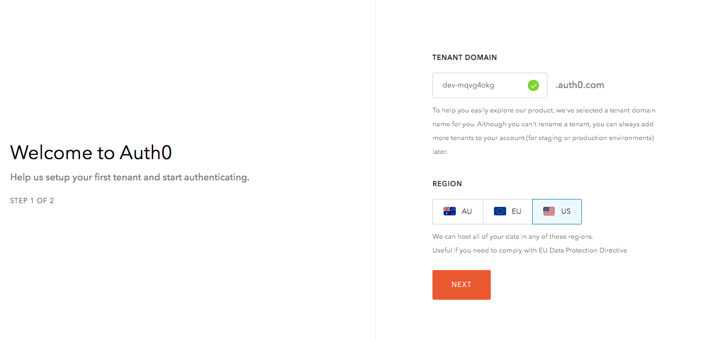
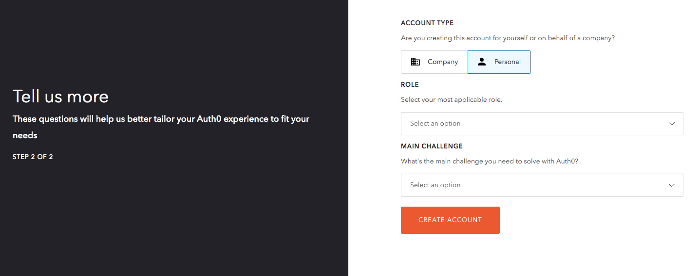
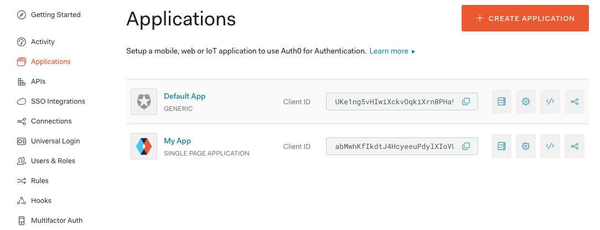
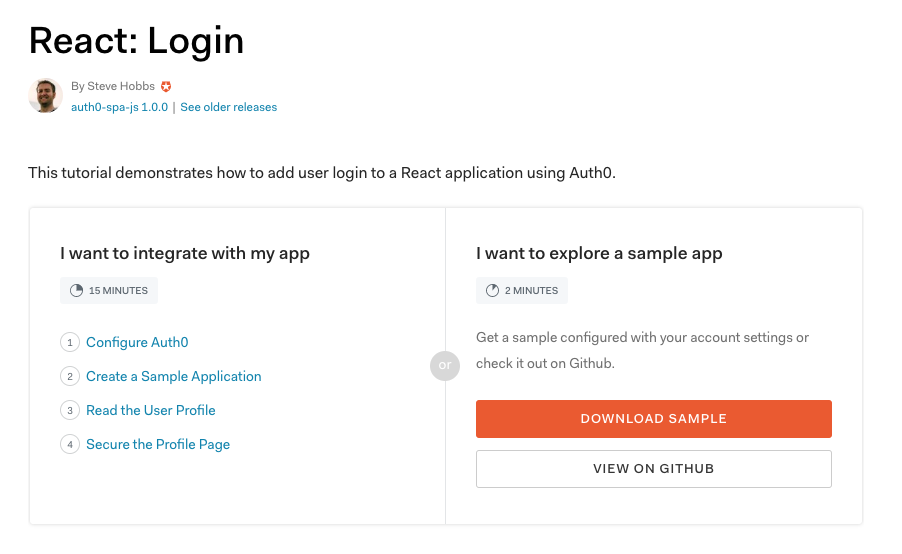
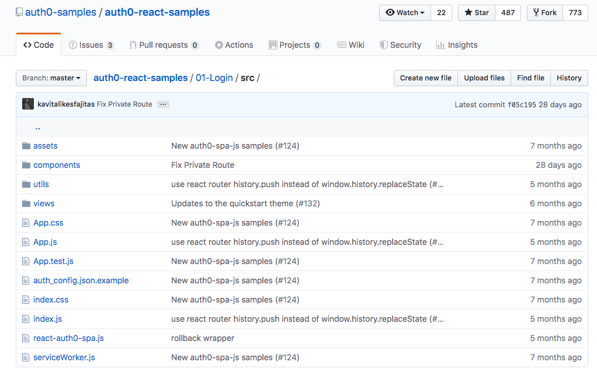

import { CodeSurferLayout, CodeSurferColumnLayout } from 'code-surfer'
import { nightOwlFull } from 'code-surfer'
import { Head } from 'mdx-deck'
import './index.css'
import { Emoji } from './Emoji.js'
import Img from 'components/Img'

export const themes = [
  nightOwlFull,
  {
    colors: {
      text: '#000',
      background: '#fff',
      primary: '#0af',
      black: '#000'
    },
    fontWeights: {
      heading: 600,
      bold: 600
    },
    text: {
      heading: {
        textTransform: 'uppercase',
        letterSpacing: '0.1em'
      }
    },
    styles: {
      pre: {
        color: 'primary',
        bg: 'black'
      },
      code: {
        color: 'primary'
      }
    }
  }
]

export { nightOwlFull as theme } from 'code-surfer'

<Head>

  <link
    href="https://fonts.googleapis.com/css?family=Montserrat:300,300i,400,400i,500,500i,700"
    rel="stylesheet"
  />
</Head>

##### *React* to Authentication with an Auth0 Custom Hook

> -Tyler Clark

---

### :wave: Nice to meet ya

> Twitter: _@iamtylerwclark_

---

##### I need to add Authentication to my app... where do I even start?

---

#### Table of Contents

- Why Auth0?
- Registering your application
- Breaking down the useAuth0 hook

---

### Why Auth0?

> "Identity made simple for Developers"

---

### Sign up step 1



---

### Sign up step 2



---

### Register an application




---

### Quick Start a React app


---

### Download Sample



---

### Sample Code



---

#### Let's Break down the useAuth0 hook

---

<CodeSurferLayout>

```js title="Context"

const Auth0Context = React.createContext()

const useAuth0 = () => useContext(Auth0Context);

```

```js title="Context"

const Auth0Context = React.createContext()

<Auth0Context.Provider
      value={{
        ...
      }}
    >
      {children}
    </Auth0Context.Provider>

```

```js title="Context"

ReactDOM.render(
  <Auth0Provider>
    <App />
  </Auth0Provider>

```

```js title="Context"

import { useAuth0 } from "../react-auth0-spa"

const { ... } = useAuth0()

```

</CodeSurferLayout>

---

<CodeSurferLayout>

```js title="Recursion"
function counter() {
  for (let n = 0; n <= 10; n++) {
    console.log(n)
  }
}

counter() // 0, 1, 2, 3, 4...
```

```js 2:4 title="Recursion"
function counter() {
  for (let n = 0; n <= 10; n++) {
    console.log(n)
  }
}

counter() // 0, 1, 2, 3, 4...
```

```js 7 title="Recursion"
function counter() {
  for (let n = 0; n <= 10; n++) {
    console.log(n)
  }
}

counter() // 0, 1, 2, 3, 4...
```

```js title="Recursion"
function counter(n) {
  console.log(n)
  return counter(n + 1)
}

counter(0) // 0, 1, 2, 3, 4...Infinity
```

```js 3 title="Recursion"
function counter(n) {
  console.log(n)
  return counter(n + 1)
}

counter(0) // 0, 1, 2, 3, 4...Infinity
```

```js 6 title="Recursion"
function counter(n) {
  console.log(n)
  return counter(n + 1)
}

counter(0) // 0, 1, 2, 3, 4...Infinity
```

```js title="Recursion"
function counter(n) {
  console.log(n)
  if (n === 10) return
  return counter(n + 1)
}

counter(0) // 0, 1, 2, 3, 4...10
```

</CodeSurferLayout>

---

# ....

---

<CodeSurferLayout>

```js title="Single lookup"
const a = [1, 2, 3, 4]
```

```js title="Single lookup"
const a = [1, 2, 3, 4]

function findLastValue(a) {
  return a[a.length]
}

console.log(findLastValue(a))
```

</CodeSurferLayout>

---

### ...


---

<CodeSurferLayout>

```js title="Linked lists"
function LinkedListNode(data) {
  this.data = data
  this.next = null
}
```

```js 2:3 title="Linked lists"
function LinkedListNode(data) {
  this.data = data
  this.next = null
}
```

```js title="Linked lists"
function LinkedListNode(data) {
  this.data = data
  this.next = null
}

const head = new LinkedListNode(1)
```

```js title="Linked lists"
function LinkedListNode(data) {
  this.data = data
  this.next = null
}

const head = new LinkedListNode(1)
head.next = new LinkedListNode(2)
```

```js 1:7 title="Linked lists"
function LinkedListNode(data) {
  this.data = data
  this.next = null
}

const head = new LinkedListNode(1)
head.next = new LinkedListNode(2)
```

```js title="Linked lists"
head = {
  data: 1,
  next: {
    data: 2,
    next: null
  }
}
```

</CodeSurferLayout>


---

<CodeSurferLayout>

```js  title="Stacks"
const stack = [1]
```

```js title="Stacks"
const stack = [1, 2]
```

```js  title="Stacks"
const stack = [1, 2, 3]
```

```js title="Stacks"
const stack = [1, 2]
```

```js title="Stacks"
const stack = [1]
```

</CodeSurferLayout>

---

# Stacks

- pop(): Remove top item from stack
- push(i): Add an item to top of stack
- peek(): Return the top of stack
- isEmpty(): Returns true if stack is empty


---

<CodeSurferLayout>

```js  title="Stacks"
function CreateStack() {
  this.stack = []
  this.pop = x => {}
  this.push = x => {}
  this.peek = () => {}
  this.isEmpty = () => {}
}

const myStack = new CreateStack()
```

</CodeSurferLayout>

---

# Queues

- First-in, first-out
- Removed in the order they are added


---

<CodeSurferLayout>

```js  title="Queues"
const queue = [1]
```

```js title="Queues"
const queue = [1, 2]
```

```js  title="Queues"
const queue = [1, 2, 3]
```

```js title="Queues"
const queue = [2, 3]
```

```js title="Queues"
const queue = [3]
```

</CodeSurferLayout>

---

# Other references

- Cracking the coding interview
- The Imposter's Handbook
- Egghead, Pluralsight, Frontend Masters courses

---

### Thanks!

